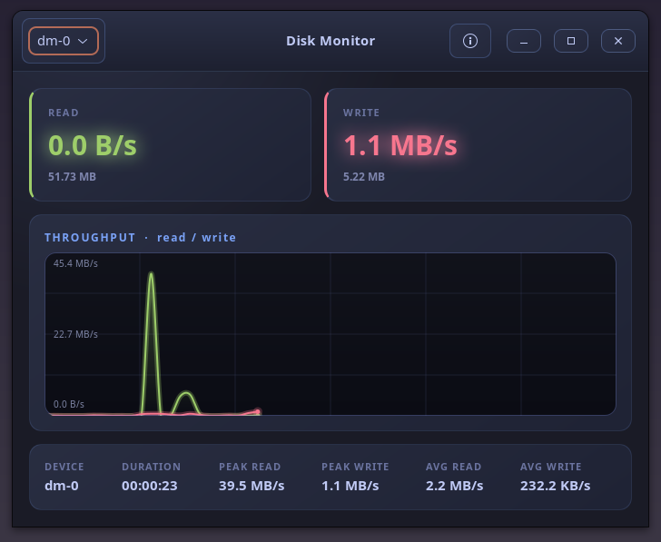

<div align="center">

<a href="https://github.com/effjy/diskmon/"></a>

**A real-time disk I/O monitor for Linux — written in C++ with a GTK4 interface
and a Tokyo Night dark theme.**

[](https://github.com/effjy/diskmon/releases)
[](LICENSE)
[](https://en.cppreference.com/)
[](https://www.gtk.org/)
[](https://www.gnu.org/software/make/)
[](https://www.kernel.org/)

</div>

`diskmon` reads `/proc/diskstats` once a second to compute live **read** and
**write** throughput for any block device, draws a smooth Cairo graph of both
streams, and tracks session **totals**, **peaks**, and **averages**. It is the
storage-side companion to the `usage` network monitor and reuses its visual
language.

Author: **Jean-Francois Lachance-Caumartin**

## Screenshot

<div align="center">



</div>

## Features

- Live read/write throughput from `/proc/diskstats` (512-byte sector accounting)
- Per-device selection (whole block devices; `loop`/`ram`/`zram` filtered out)
- Smooth, glowing Cairo throughput graph with auto-scaling
- Session stats: total bytes, duration, peak and average read/write
- Single global icon used by the window, taskbar, and About dialog
- GTK4 About-dialog stray-selection workaround built in

## Prerequisites

You need a C++17 compiler, `make`, `pkg-config`, and the GTK4 development
headers. Install them with your distribution's package manager:

**Debian / Ubuntu**
```sh
sudo apt install build-essential pkg-config libgtk-4-dev
```

**Fedora**
```sh
sudo dnf install gcc-c++ make pkgconf-pkg-config gtk4-devel
```

**Arch / Manjaro**
```sh
sudo pacman -S base-devel gtk4
```

## Build

```sh
git clone https://github.com/effjy/diskmon.git
cd diskmon
make
```

This produces the `diskmon` binary in the project directory. You can run it
straight from there with `./diskmon`.

## Install

```sh
sudo make install     # binary, .desktop entry, and icons (256px + scalable)
```

`make install` copies the binary to `/usr/local/bin`, installs the `.desktop`
launcher, places the icon under `/usr/share/icons/hicolor/...`, and refreshes the
icon cache so the window, taskbar, and About dialog all resolve `diskmon`. After
this you can launch **Disk Monitor** from your application menu.

To remove everything:

```sh
sudo make uninstall
```

## Usage

Launch from your application menu (after installing) or from a terminal:

```sh
diskmon          # if installed
./diskmon        # from the build directory
```

No root privileges are required — `diskmon` only reads `/proc/diskstats` and
`/sys/block`.

- **Pick a device** from the dropdown in the header bar. Whole block devices are
  listed (e.g. `nvme0n1`, `sda`, `vda`); `loop`, `ram`, and `zram` devices are
  hidden. Switching devices resets the session counters.
- **Watch the graph** — the green line is read throughput, the red line is write
  throughput. The vertical scale auto-adjusts to the busiest stream.
- **Read the cards** for the current read/write speed and the total bytes
  transferred since you selected the device.
- **Check the stats row** for session duration plus peak and average read/write
  speeds.
- **About** — click the ⓘ button in the header bar for version and license info.

Counters update once per second.

## License

Released under the [MIT License](LICENSE).
